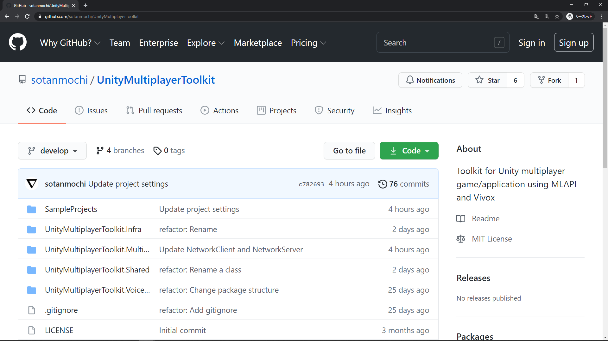
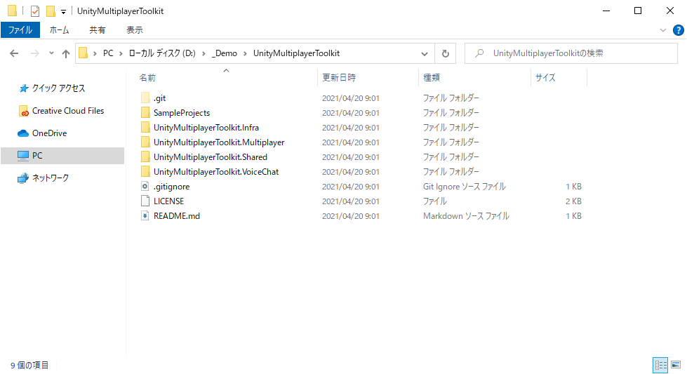
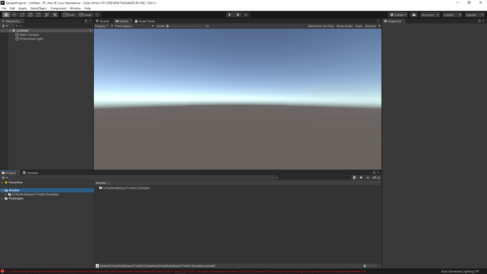
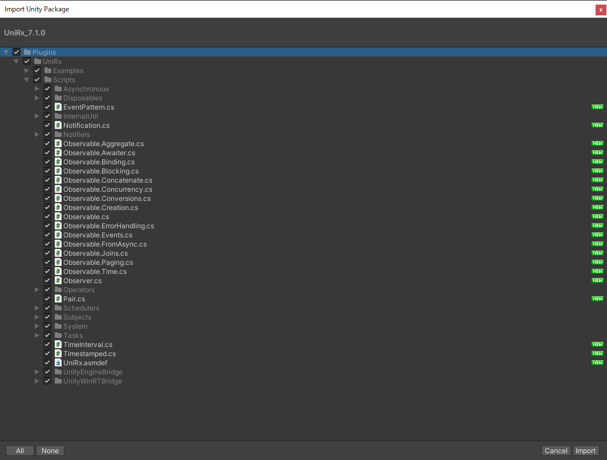
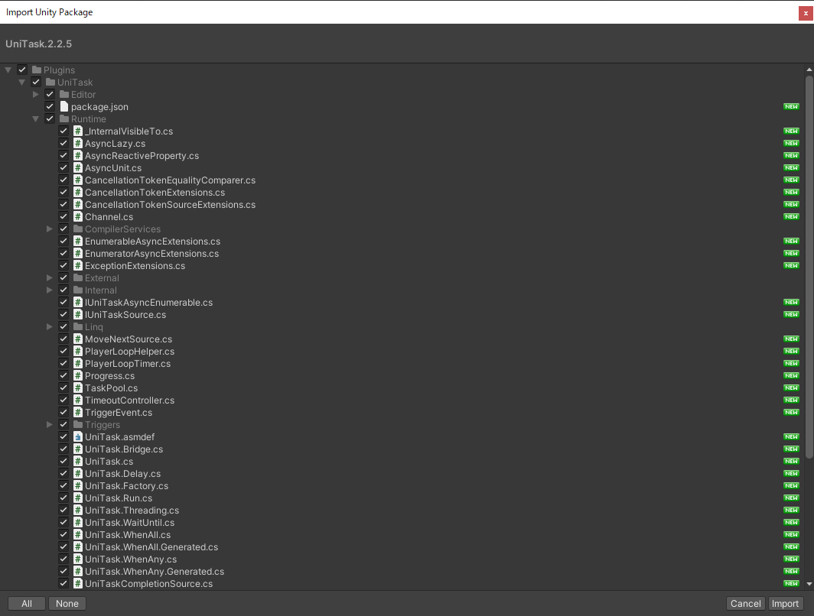
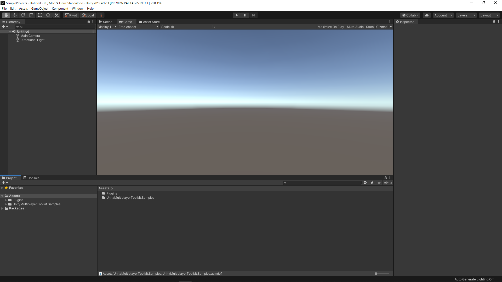

# Project setup

## 1.
プロジェクトをクローンする

## 2.
"SampleProjects"をUnityで開く

## 3.
[UniRx 7.1.0](https://github.com/neuecc/UniRx/releases/tag/7.1.0)と[UniTask 2.2.5](https://github.com/Cysharp/UniTask/releases/tag/2.2.5)をインポートする

## 4.
コンパイルエラーが発生していなければUnityプロジェクトのセットアップ完了

