# SimpleMultiplayer Local Test

## Contents
- サーバーシーンのビルド
- サーバーシーンの実行
- クライアントシーンの実行（Unity Editor）
- クライアントシーンのビルド
- クライアントシーンの実行（exe）

## 1. サーバーシーンのビルド

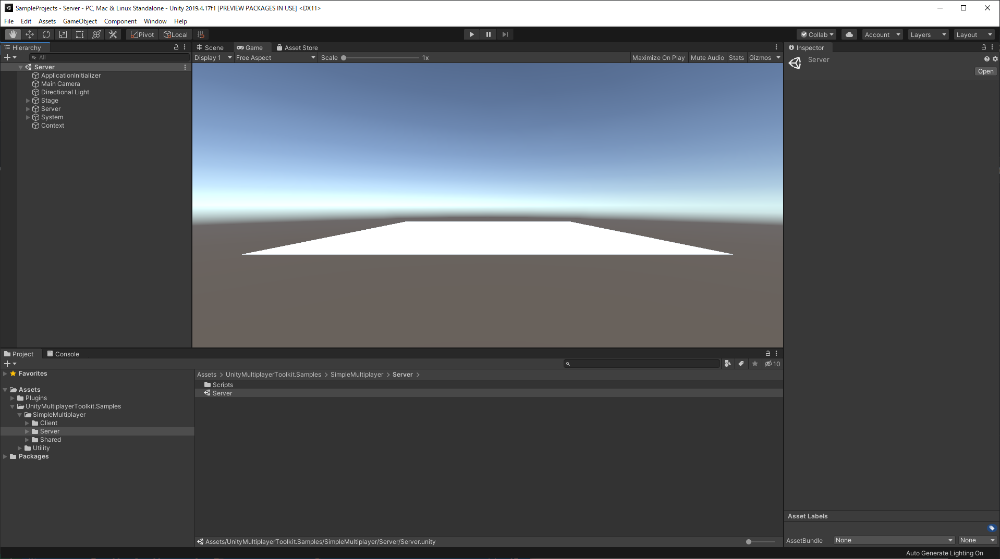
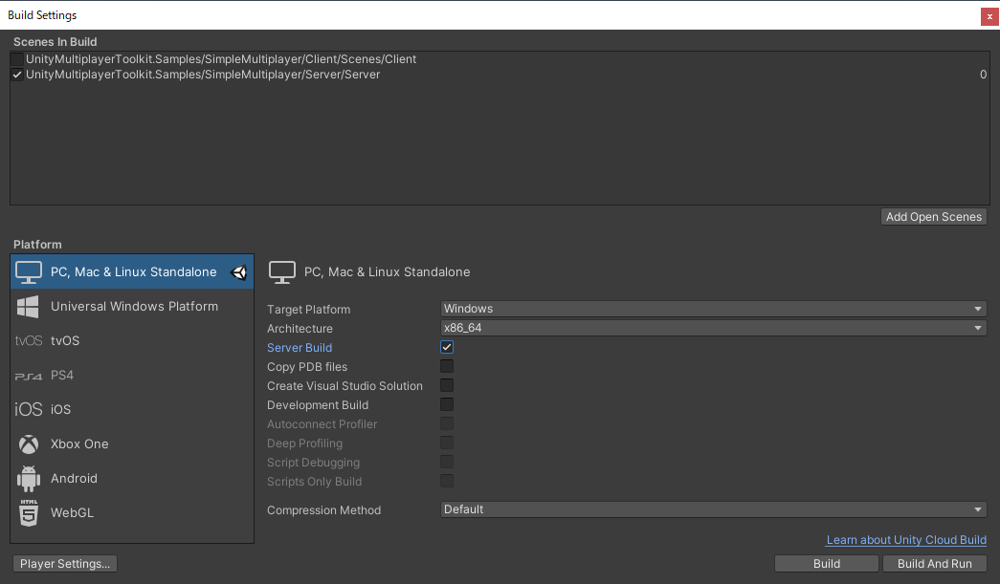
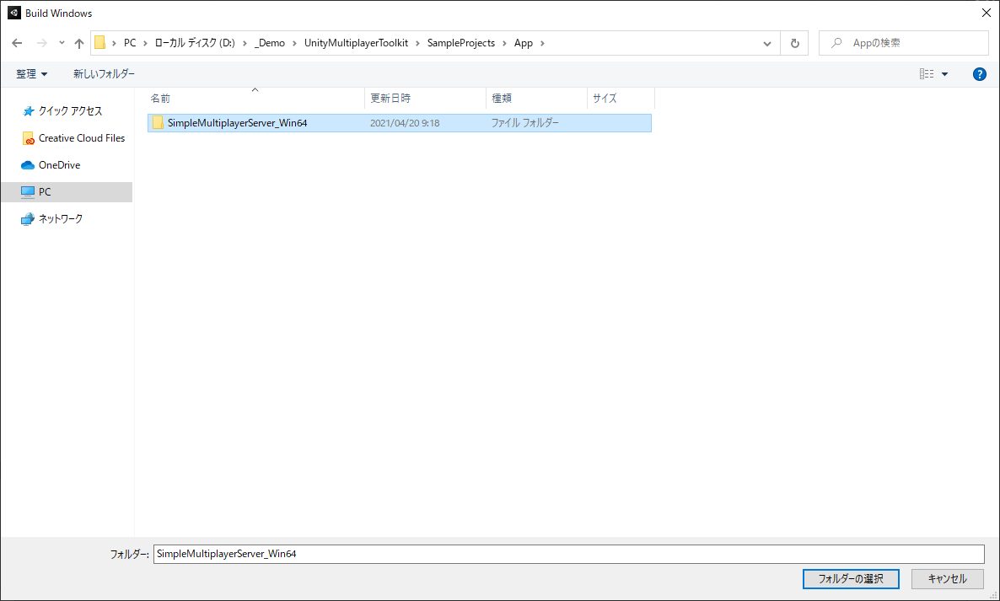

## 2. サーバーシーンの実行

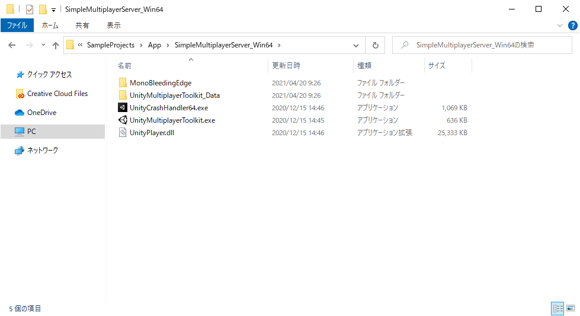
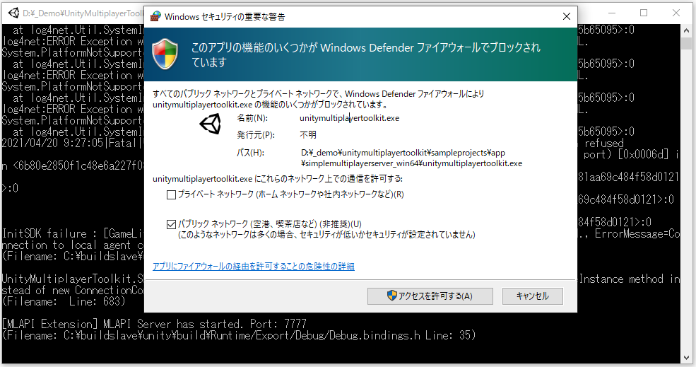
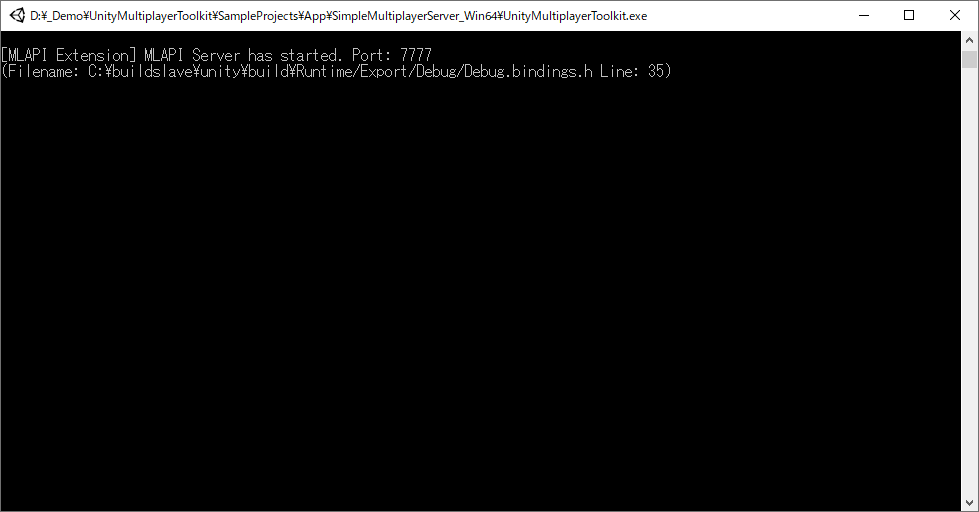

## 3. クライアントシーンの実行（Unity Editor）

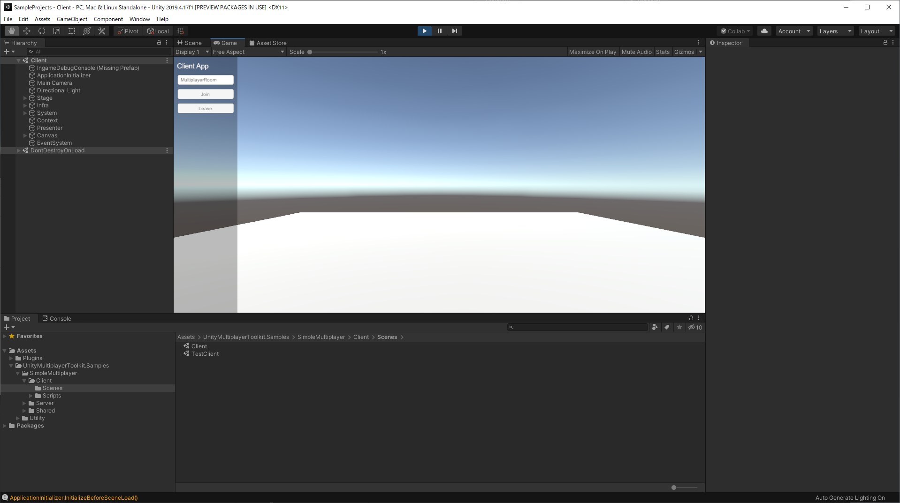
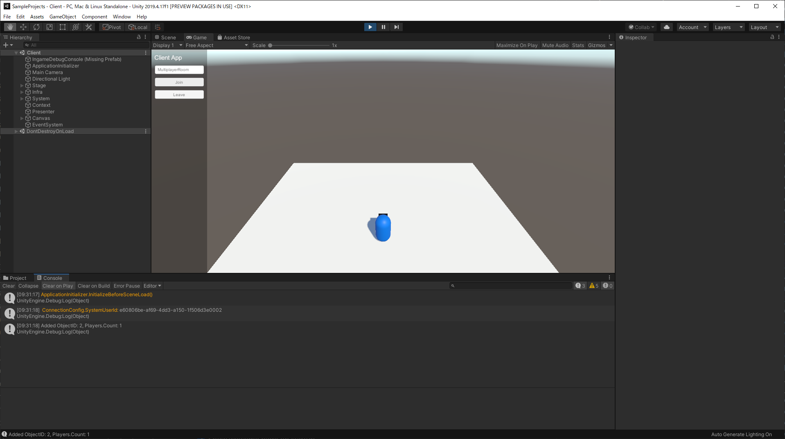

## 4. クライアントシーンのビルド

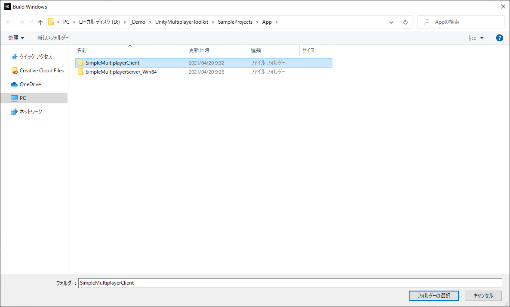
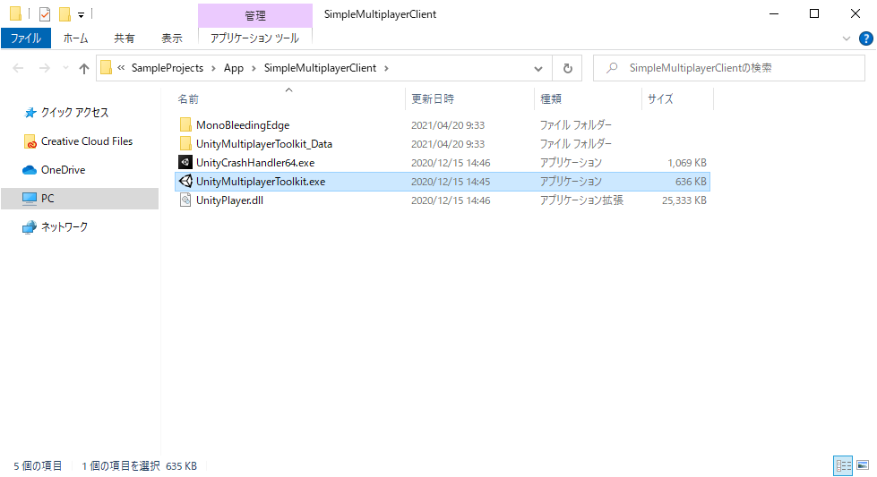

## 5. クライアントシーンの実行（exe）

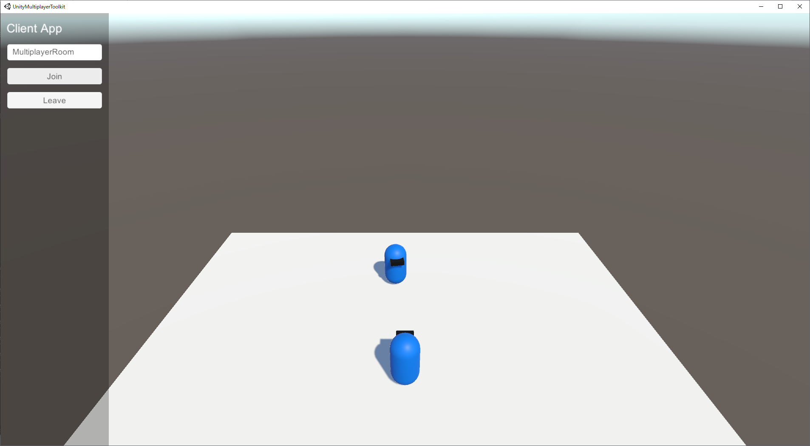
