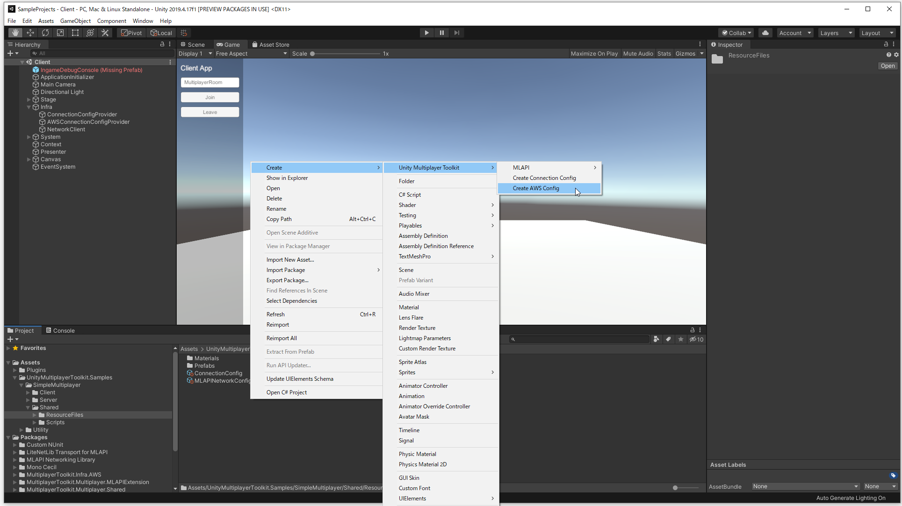
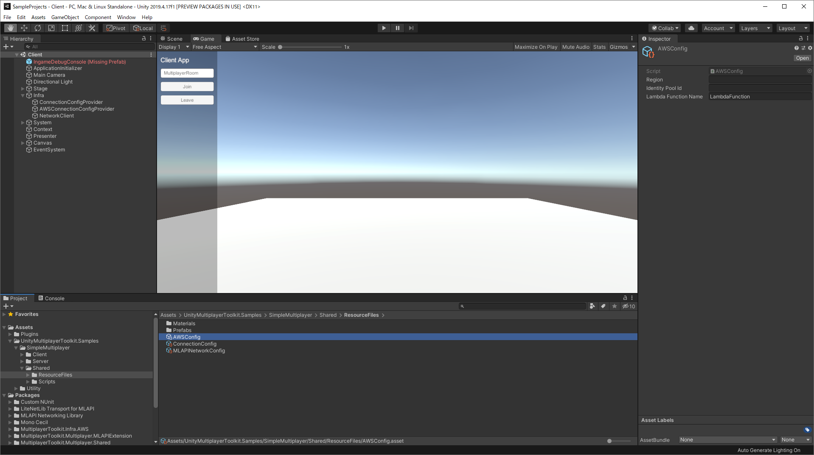
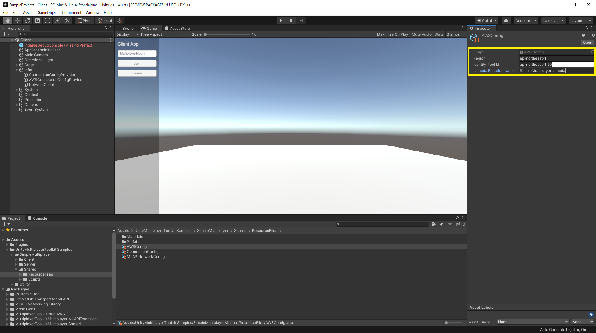
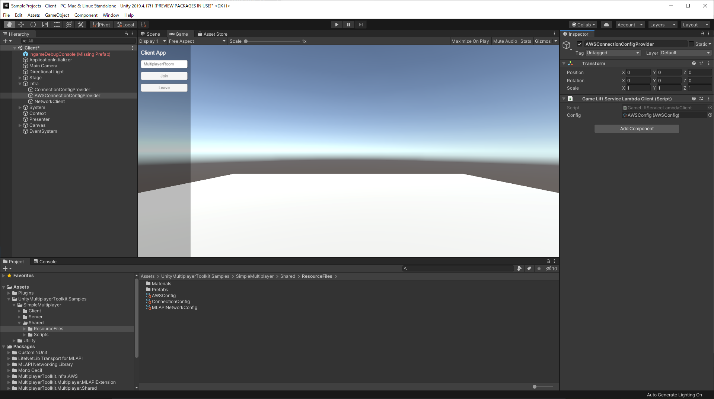
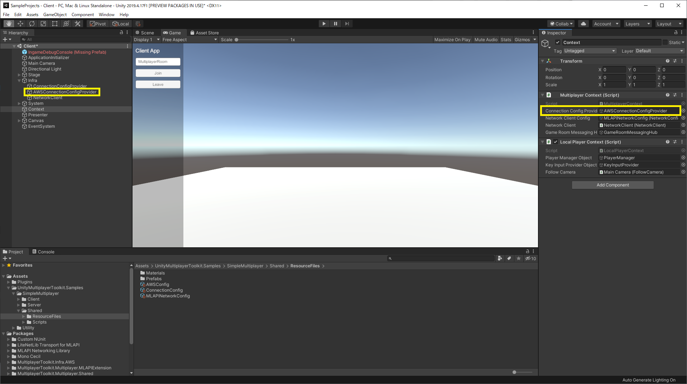
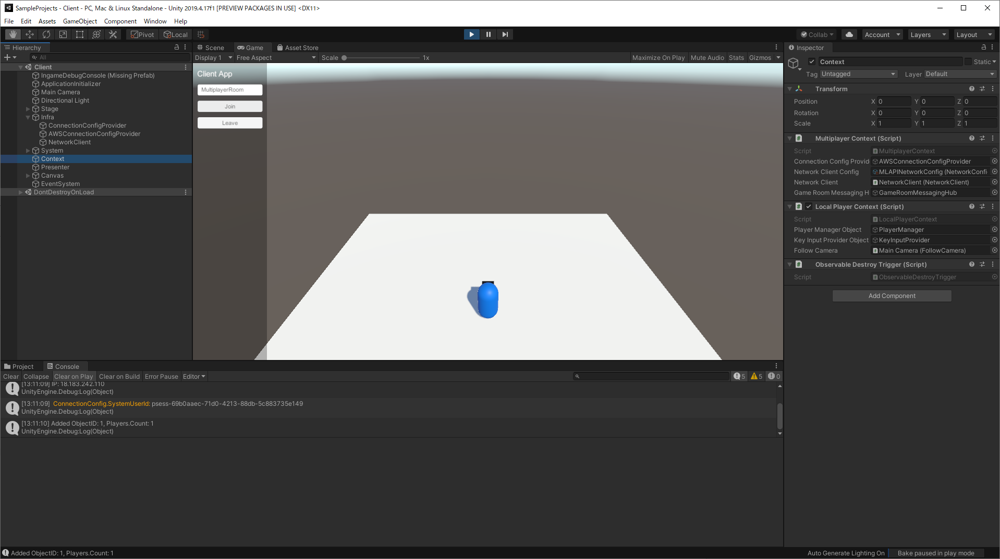

# SimpleMultiplayer Client Connection to Server on AWS

## 1. 設定ファイルの作成
- "Create -> UnityMultiplayerToolkit -> Create AWS Config"からコンフィグファイルを作成する
- リージョン、Cognito ID PoolのID、Lambdaの関数名をセットする

## 2. シーン更新
- AWS ConfigをAWSConnectionConfigProviderにセットする
- MultiplayerContextのConnectionConfigProvidrにAWSConnectionConfigProviderをセットする

## 3. クライアントシーンの実行（Unity Editor）
- ルーム名を入力してJoinボタンを押す
- プレイヤーが表示されればOK

