# Setup GameLift Server
## Build Server

- GameRoomContextのIsLocalServerをfalseに設定

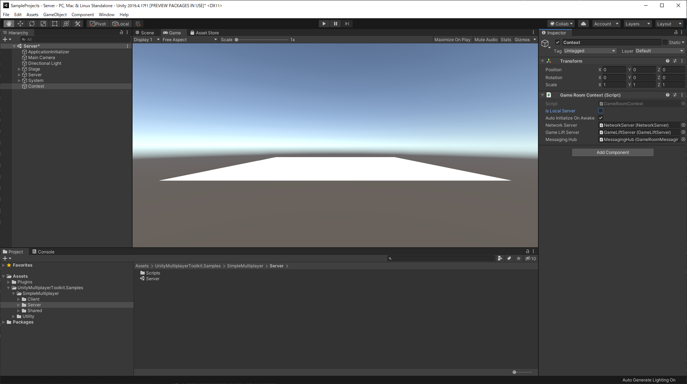

- Linuxビルド

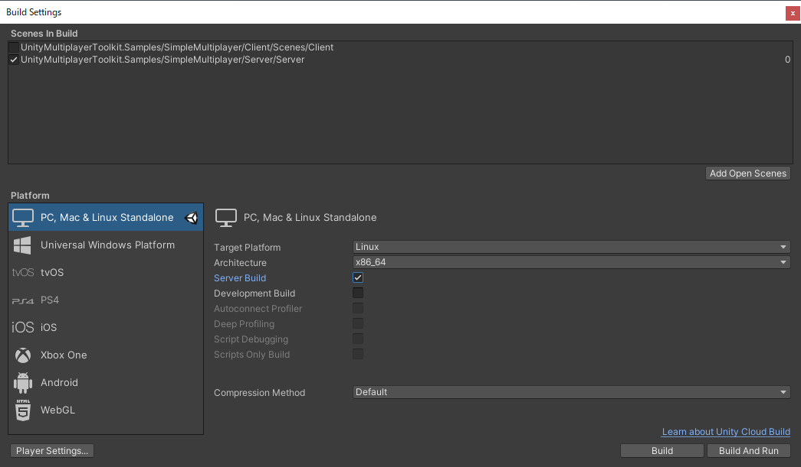
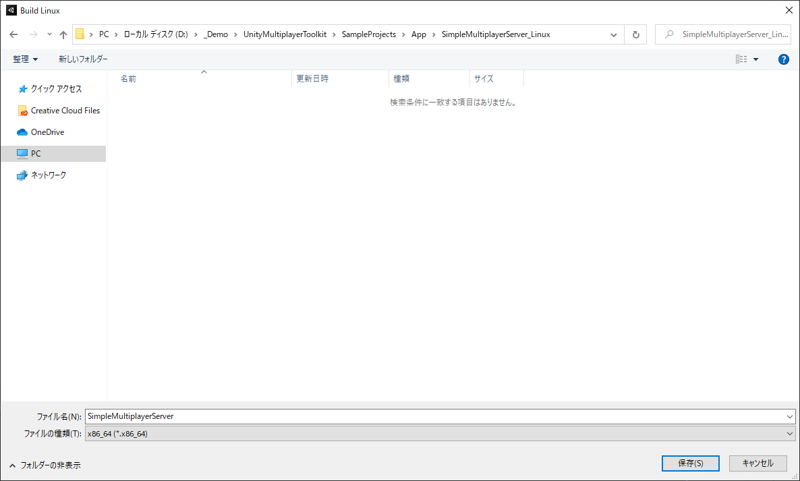

## Setup GameLift Server
- AWS CLIを使ってビルドをアップロードする

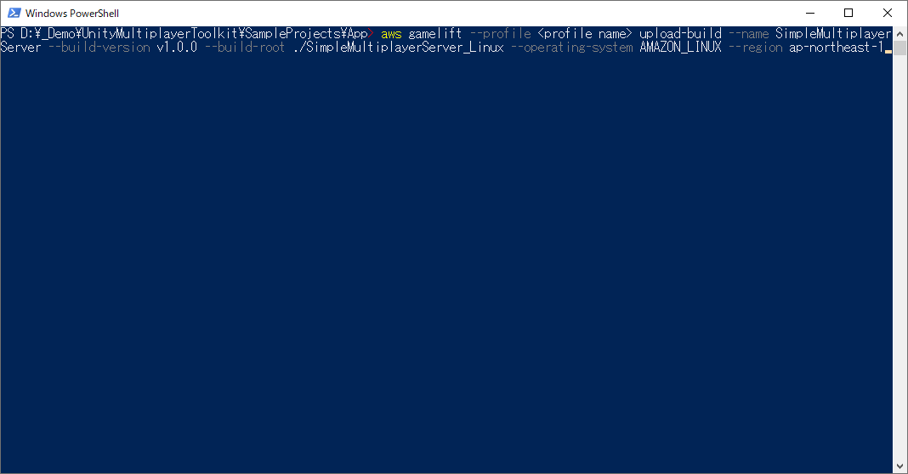
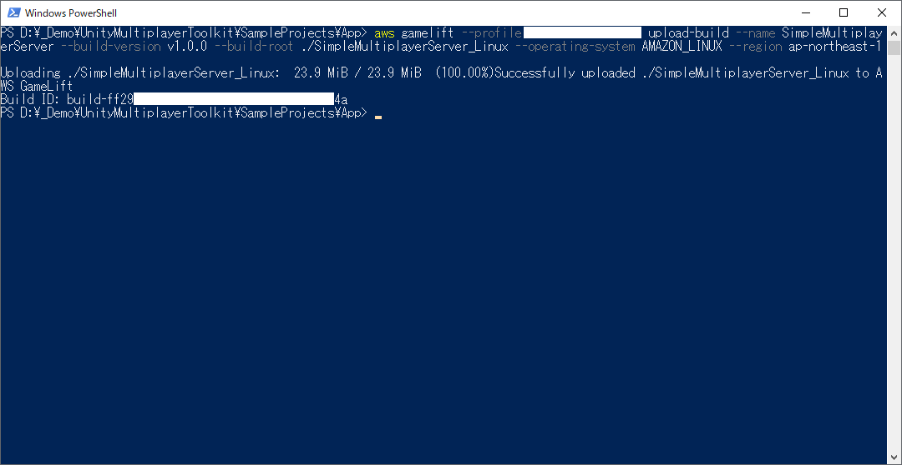
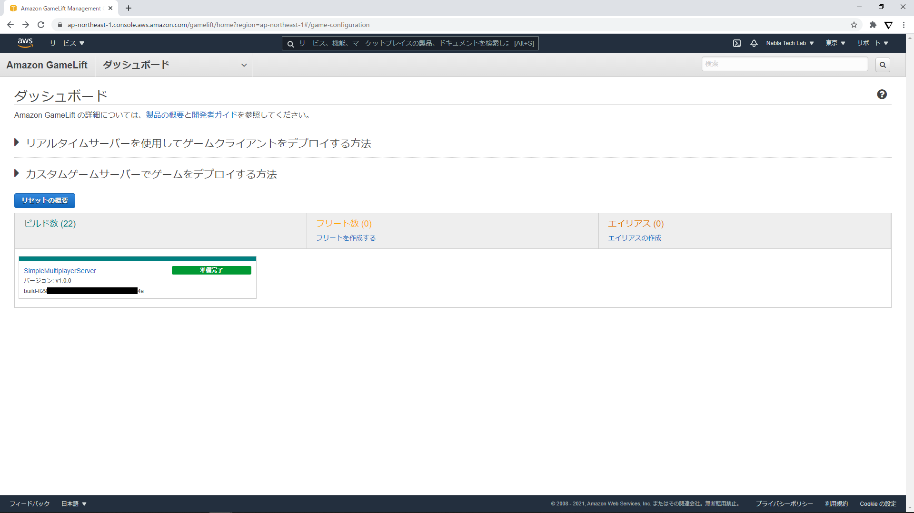

## Create Fleet
- フリートを作成する

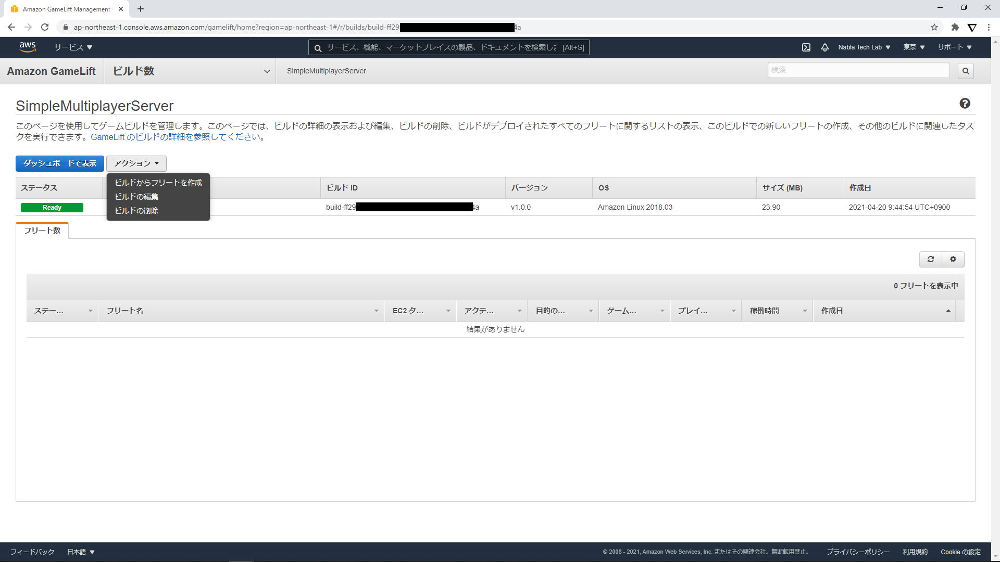
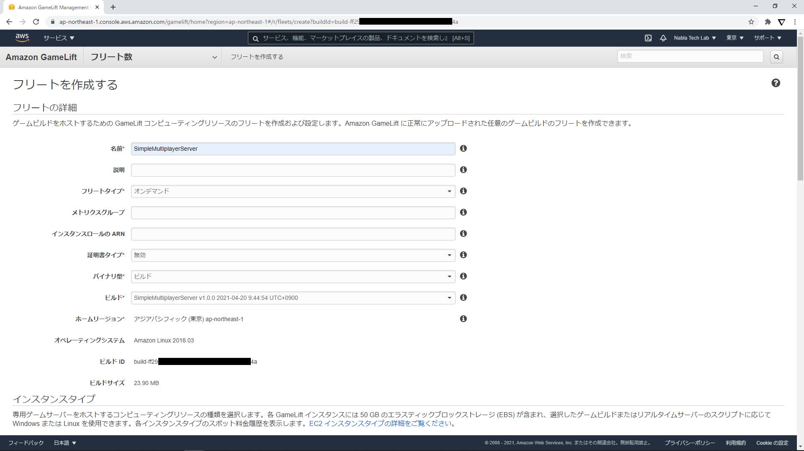
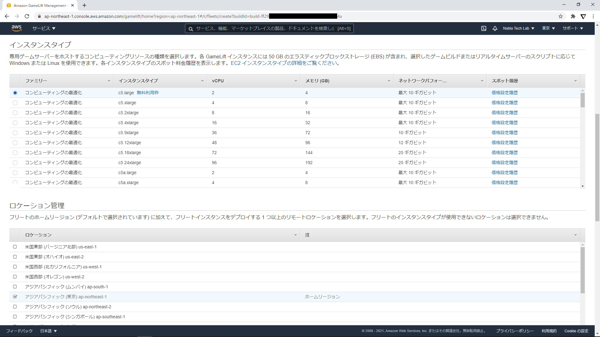

### Settings
- ポート番号を設定する
- 1つのサーバーで複数プロセスの起動が可能

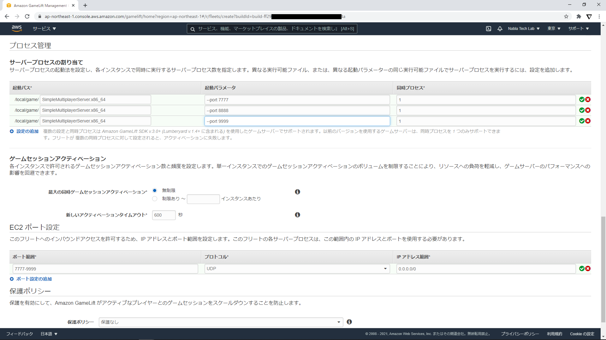
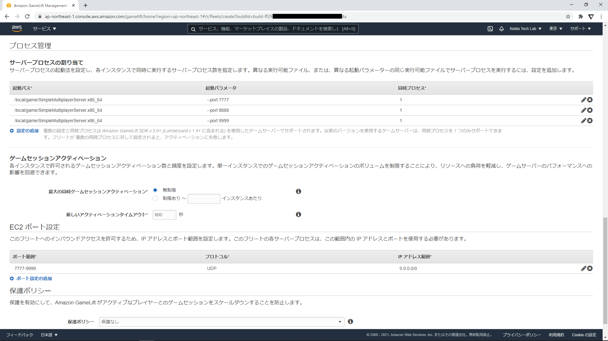
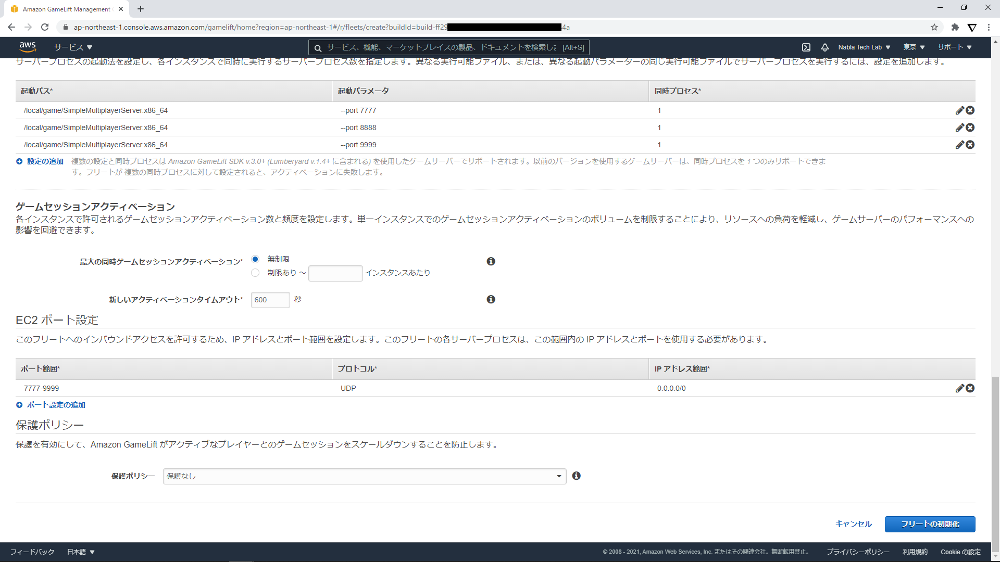

## Created Fleet
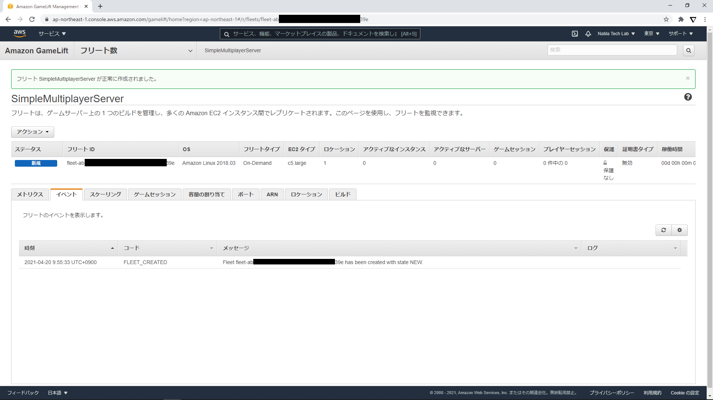
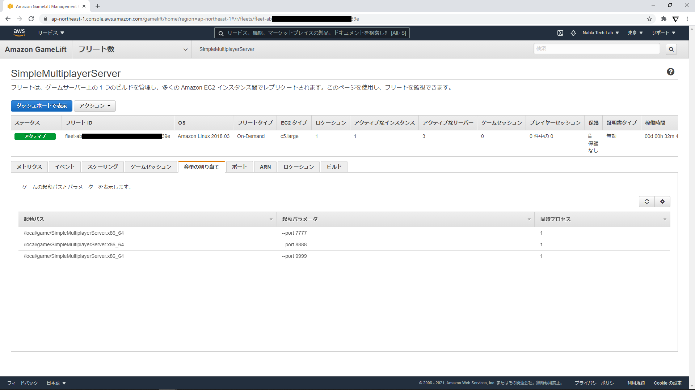
