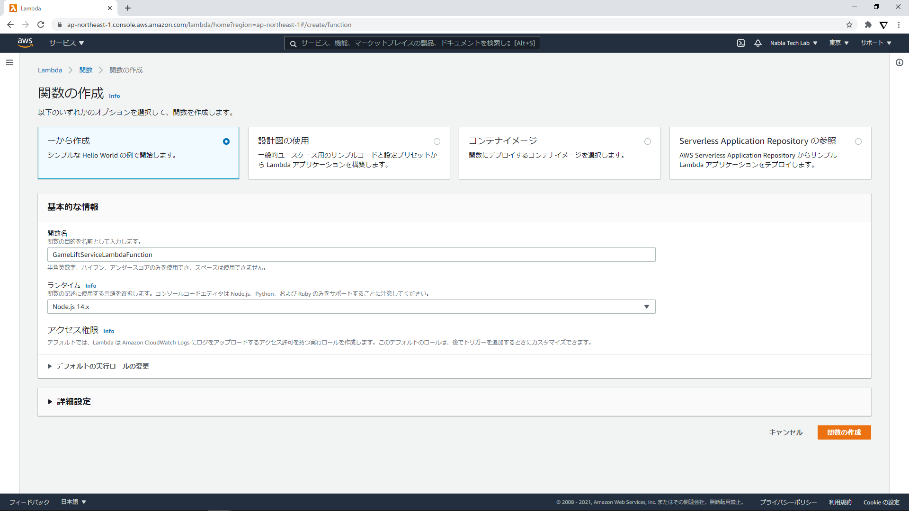
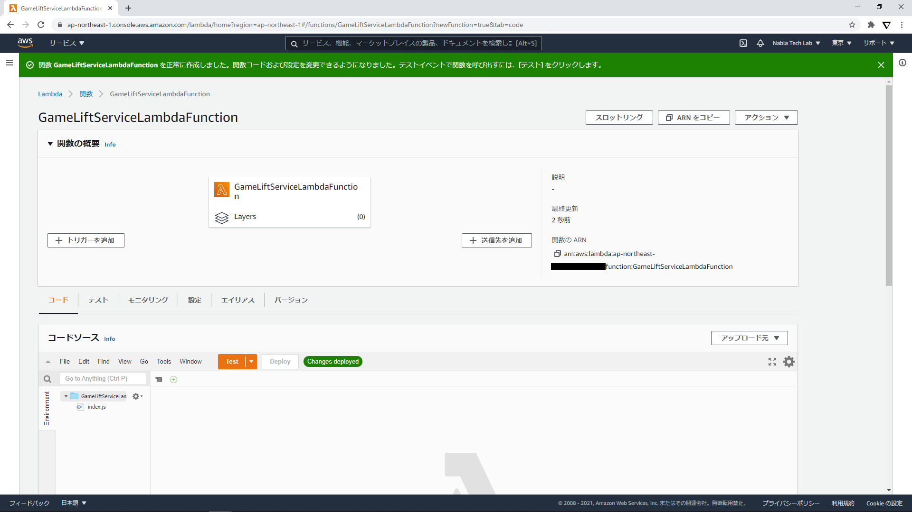
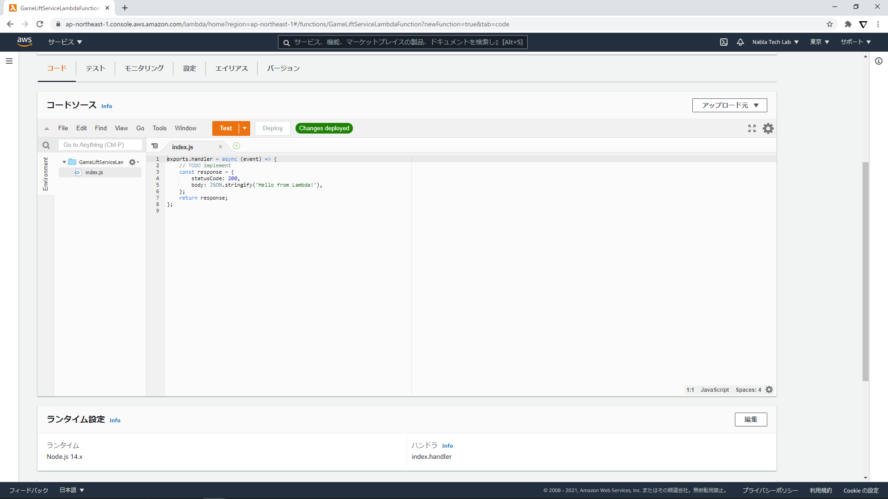
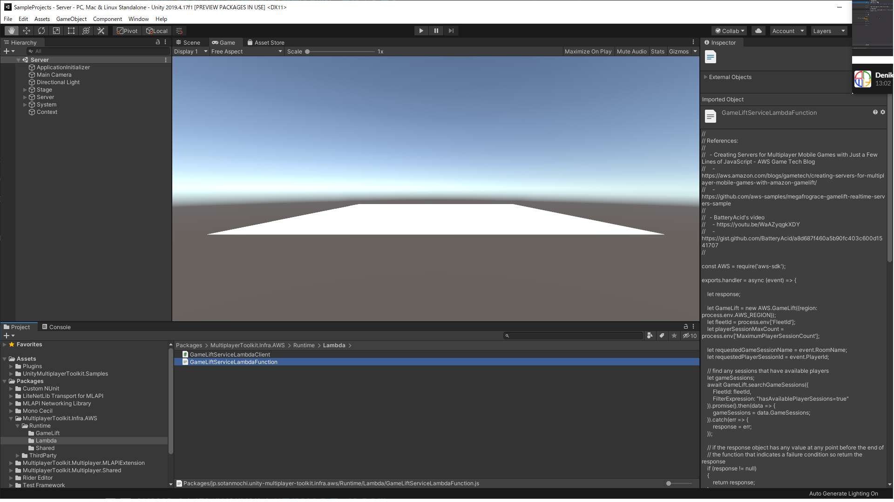
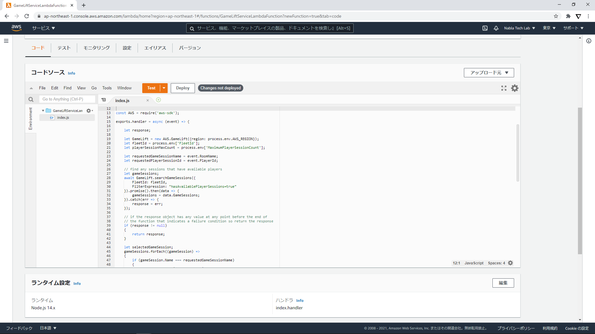
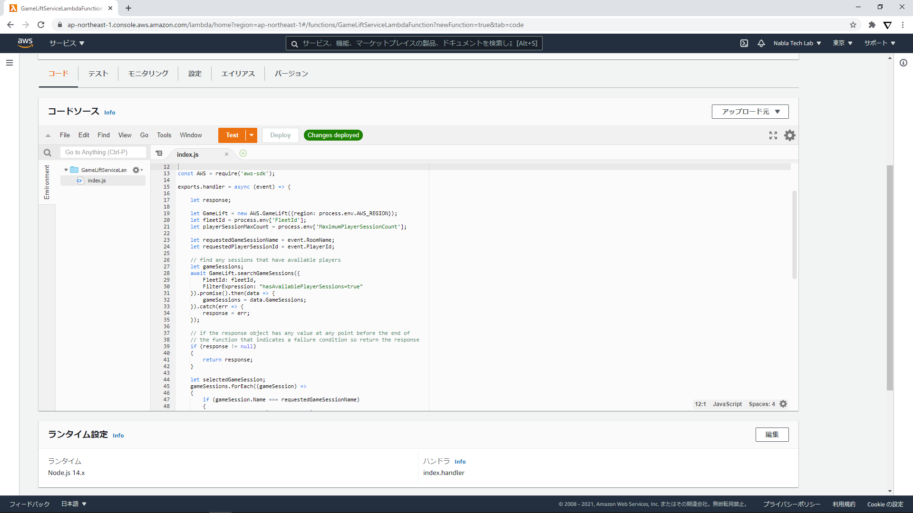
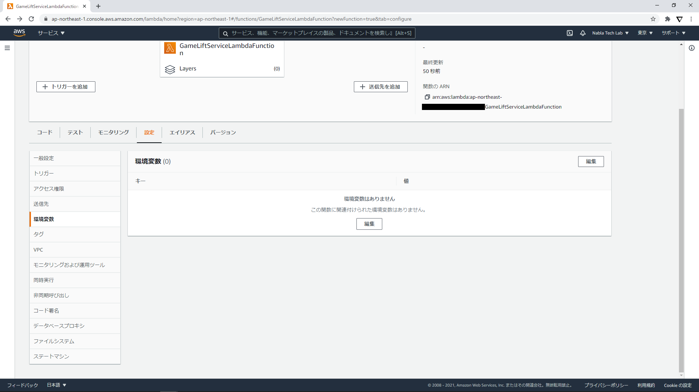
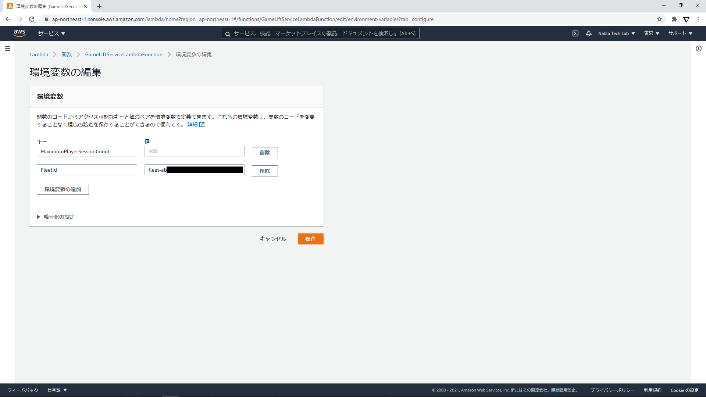
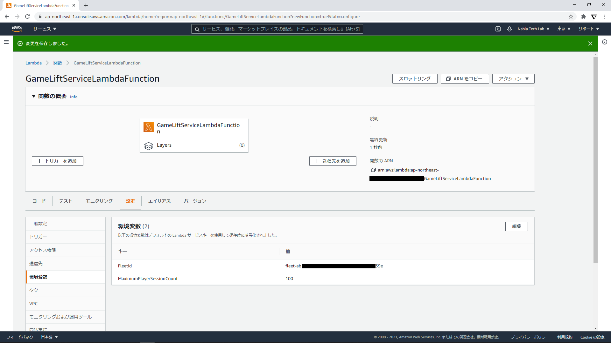
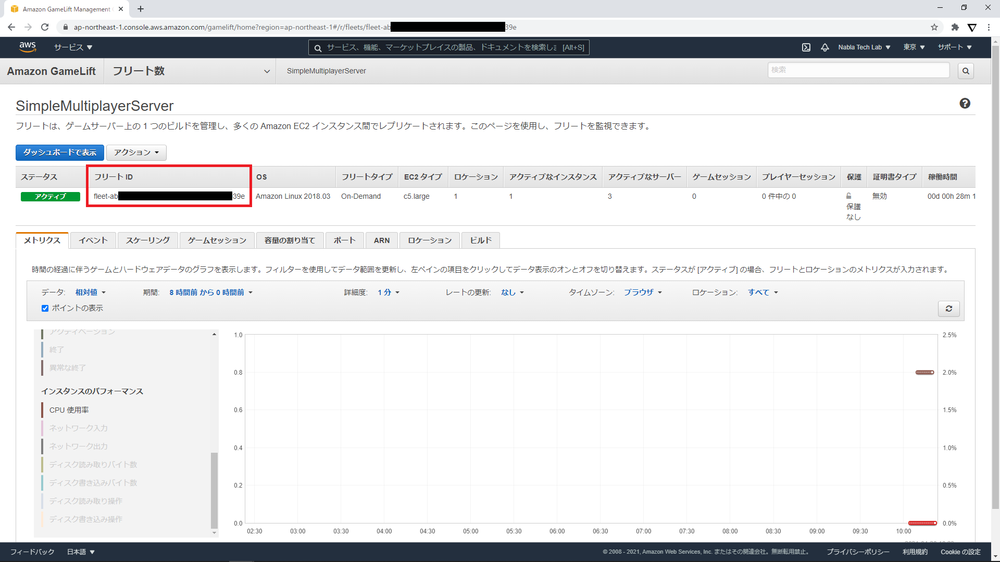

# Setup Lambda Funcion

## Create Function

## Implement Function
- "UnityMultiplayerToolkit.Infra/AWS/Runtime/Lambda"にある"GameLiftServiceLambdaFunction.js"の内容をindex.jsに実装してデプロイする

## Configure
- 環境変数にFleet IDを設定する

